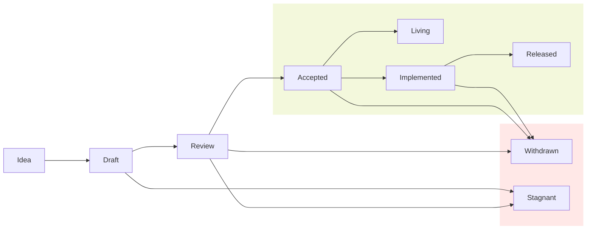

## Summary

**What is a Story Improvement Proposal?** 

A SIP is a document that proposes standards, guidelines, and recommendations
 for the Story network and its broader ecosystem. It must include complete 
 rationale, context, and sufficient details for the proper implementation.

## Motivation

Each proposal undergoes review by community members, with careful 
consideration of security concerns, tradeoffs, and backwards compatibility. 
This process serves multiple purposes: it helps catch design issues early,
 keeps the community informed of changes, assists new contributors in 
 understanding the architecture, and creates a historical record of Story's 
 design decisions. For developers, the proposal acts as a blueprint that 
 guides feature development and implementation.

## Proposal 

**When you need to follow this process?**

You need to follow this process if you intend to make "substantial" changes to
the network architecture and its parameters, software implementation details,
 and other standards impacting the broader ecosystem. 

The definition of a "substantial" change evolves with community norms and 
varies across different parts of the ecosystem. Such changes may include the 
following:

- A change in format user interfaces (e.g. JSON-RPC API changes)
- Protocol parameters (e.g. target block production rate)
- Node hardware minimum requirement changes

Some changes do not require a proposal, for example:

- Rephrasing, reorganizing, refactoring, or otherwise changing structure 
without altering meaning.
- Performance improvements to the node software without impacting any other 
nodes or users.

### SIP Types

Story Improvement Proposals (SIPs) fall into these categories:

- **Standard SIP**: A proposal that describes changes to the Story Network, 
including but not limited to blockchain architecture and operational 
parameters, node software implementation details, and other major changes to 
the core APIs and user interface. For example, a proposal in this category 
can discuss changes to the block production details or node level networking 
parameters.

- **Ecosystem SIP:**A proposal describing application-level standards, 
conventions and specifications that may affect applications, tools, and 
services built on top of the Story network. These proposals outline 
conventions, interfaces, and protocols that ecosystem participants can follow 
to ensure compatibility and interoperability across the platform.  Such 
standards may encompass development tooling, libraries, APIs, and other 
ecosystem applications that enhance the functionality and user experience of 
the Story network. For example, a proposal in this category can define what 
method and events a non-fungible token contract should support.

- **Meta SIP**: A proposal that describes or suggests changes to the SIP 
process, including its structure, lifecycle, and guidelines. For example, a 
proposal in this category might suggest expanding SIPs into additional 
categories.

### Access Control

While this repository is open for everyone to contribute, community members 
are granted two levels of access to prevent spam, scams, and unrelated posts.

- `Contributor`: Community members who have reviewed draft ideas in the forum
 can receive this role from maintainers, allowing them to create PRs in this
 repository. Once this role is gained it stays active for future, unless
 with active votes of majority of maintainers

- `Maintainer`: Maintainers are community members who facilitate the process 
by reviewing proposal states and guiding them through the pipeline. Any 
proposal state change requires a majority vote from maintainers. 
Monthly open-to-all meetings are held to review SIPs and allocate roles. 
Through majority voting (2/3), maintainers can grant or revoke both contributor 
and maintainer roles within the community.

### SIP Lifecycle

Every SIP starts as an Idea and follows the lifecycle as it progresses.

#### Idea

Every SIP begins as an idea shared with the community through [the Story 
's community forum](https://forum.story.foundation/). Please don't 
create any pull request at this stage. 
After thorough discussion and gathering support, it can be converted 
into a SIP pull request in draft. Before this conversion, each idea requires 
at least one sponsor. Sponsors are well-known community members who either 
benefit from the proposal or have deep expertise in the subject matter.

When an idea has received sufficient feedback and is ready to move into a 
draft, it can be converted into a SIP draft pull request. Opening up PRs 
in this repo requires a "contributor" role. If an author of the proposal 
does not already have a contributor role, the maintainers will add one 
or more of the proposal's authors to the contributor list.

#### Draft

To begin drafting the proposal, do the following:

- Fork the proposal repository
- Copy `XXXXX-template.md` to `proposals/XXXXX-proposal-title.md` (where 
"proposal-title" is descriptive)
- Proposals must be detailed and well-researched. They should provide strong 
motivation, demonstrate understanding of design implications, and address 
potential drawbacks and alternatives thoroughly. Incomplete or poorly 
justified proposals may be rejected. 
- Commit the changes and create a pull request.
- Please use the issue number of the pull request to update the `XXXXX-` in 
the file name and headers of the proposal.

#### Review

During the draft phase, proposal authors are responsible for collecting and 
incorporating feedback. Key core contributors relevant to the proposal must 
be included in the review process. All reviews occur through GitHub to ensure 
proper documentation of comments. Once authors feel their proposal is ready 
for review, they can update its state to "review" and present it at one of 
the Story Foundation's online review meetings. During these meetings, a 
decision about the proposal is made after thorough consideration of various 
tradeoffs. 

#### Accepted

Accepted proposals fall into two categories: vital features for immediate 
implementation and lower-priority features that await a core contributor's 
attention. Each accepted proposal must have a tracking issue in the Story 
repository. While proposal authors aren't necessary required to implement 
their proposals, this is the most effective path to completion—authors 
shouldn't assume other project developers will take on the implementation 
work. Unless a proposal is in living state, the proposal becomes immutable 
and only acceptable additions to the proposal is security considerations 
discovered after the fact.

#### Implemented

Once all relevant teams have completed development of the SIP's proposal, the 
SIP moves to "Implemented" status.

#### Released

A proposal will have the status Released once it has been implemented, 
tested, and finally released on the mainnet.

#### Stagnant

If a proposal remains inactive for 6 months, it will be marked as stale and 
closed. However, a new proposal can be submitted if the closed proposal has 
potential for reaching consensus.

#### Withdrawn

The author has withdrawn the proposal. This decision is final and 
irreversible. Any future pursuit of this idea will be treated as a new 
proposal.

### Drawbacks

N/A

## User Impact

This process enables the community to propose network changes, providing 
flexibility while maintaining consistent standards for all users.

## Alternatives Considered

This proposal draws inspiration from the excellent work of the authors of:

- [Ethereum's Improvement Proposals (EIPs) document](https://eips.ethereum.org/EIPS/eip-1)
- [Solana's SIMD](https://github.com/solana-foundation/solana-improvement-documents/blob/main/proposals/0001-simd-process.md)
- [Flow's Flip](https://github.com/onflow/flips)
