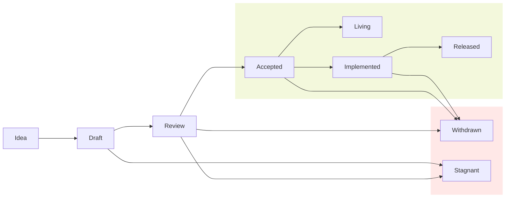

## What is a Story Improvement Proposal?

A SIP is a document that proposes standards, guidelines, and recommendations for the Story network and its broader ecosystem. It must include complete rationale, context, and sufficient details for the proper implementation.

## Rationale

Each proposal undergoes review by community members, with careful consideration of security concerns, tradeoffs, and backwards compatibility. This process serves multiple purposes: it helps catch design issues early, keeps the community informed of changes, assists new contributors in understanding the architecture, and creates a historical record of Story's design decisions. For developers, the proposal acts as a blueprint that guides feature development and implementation.

## When you need to follow this process

You need to follow this process if you intend to make "substantial" changes to
the network architecture and its parameters, software implementation details, and other standards impacting the broader ecosystem. 

The definition of a "substantial" change evolves with community norms and varies across different parts of the ecosystem. Such changes may include the following:

- A change in format user interfaces (e.g. JSON-RPC API changes)
- Protocol parameters (e.g. target block production rate)
- Node hardware minimum requirement changes

Some changes do not require a proposal, for example:

- Rephrasing, reorganizing, refactoring, or otherwise changing structure without altering meaning.
- Performance improvements to the node software without impacting any other nodes or users.

## SIP Types

Story Improvement Proposals (SIPs) fall into these categories:

- **Standard SIP**: A proposal that describes changes to the Story Network, including but not limited to blockchain architecture and operational parameters, node software implementation details, and other major changes to the core APIs and user interface. For example, a proposal in this category can discuss changes to the block production details or node level networking parameters.
- **Ecosystem SIP:**A proposal describing application-level standards, conventions and specifications that may affect applications, tools, and services built on top of the Story network. These proposals outline conventions, interfaces, and protocols that ecosystem participants can follow to ensure compatibility and interoperability across the platform.  Such standards may encompass development tooling, libraries, APIs, and other ecosystem applications that enhance the functionality and user experience of the Story network. For example, a proposal in this category can define what method and events a non-fungible token contract should support.
- **Meta SIP**: A proposal that describes or suggests changes to the SIP process, including its structure, lifecycle, and guidelines. For example, a proposal in this category might suggest expanding SIPs into additional categories.

## SIP Lifecycle

Every SIP starts as an Idea and follows the lifecycle as it progresses.

### Idea

Every SIP starts as an idea first shared with the community through the story forum, and after thorough discussion and attracting a supports and it can then be converted int a SIP draft. 

Each idea needs at least one sponsor , a well-known community member with expertise in the subject matter, before turning into a draft. 

### Draft

To begin drafting the proposal, do the following:

- Fork the proposal repository
- Copy `XXXX-template.md` to `proposals/XXXX-my-feature.md` (where "my-feature"
is descriptive)
- Fill in the proposal. Put care into the details: proposals that do not
present convincing motivation, demonstrate lack of understanding of the
design's impact, or are disingenuous about the drawbacks or alternatives tend
to be poorly received. Low quality proposals with limited engagement will be
closed by SIP repository maintainers.
- Submit a pull request.
- Now that your proposal has an open pull request, use the issue number of the
PR to update the `XXXXX-` prefix to the number (please update both the file name and document headers)

### Review

During review, the owner of the proposal is in charge of gathering and
integrating feedback. The most relevant core contributors to the proposal
should be included in the review process. Review will take place completely
through Github so that all comments are collected and documented. Once
consensus is met by the core contributors, the proposal can either be accepted
or withdrawn. This step is typically taken when enough tradeoffs have been
considered for the core contributors to make a decision. It is not necessary
for all participants to reach consensus. However, there should not be a strong
consensus against the proposal outside of the core contributors.

### Accepted

Some accepted proposals represent vital features that can be implemented right
away. Other accepted proposals can wait until some arbitrary core contributor
feels like doing the work. Every accepted proposal should have an associated
tracking issue in the Story repository. If the implementation requires the
feature to be activated using the feature activation program, a feature-gate
issue for tracking across clusters should also be created. While it is not
*necessary* for the proposal author to also write the implementation, it is by
far the most effective way to see a proposal through to completion: authors
should not expect that other project developers will take on responsibility for
implementing their accepted feature.

### Implemented

Once all relevant teams have completed development of the SIP's proposal, the SIP moves to "Implemented" status.

### Released

A proposal will have the status Released once it has been implemented,
tested, and finally released on the mainnet.

### Stagnant

If a proposal reaches 6 months without activity, the proposal will be
marked as stale to be closed. A new proposal can be opened if the proposal is
closed and has a chance of reaching consensus.

### Withdrawn

The author has withdrawn the proposal. This state has finality and can no
longer be resurrected. If the idea is pursued at a later date it is considered
a new proposal.

## Acknowledgments

This proposal draws inspiration from the excellent work of the authors of:

- [Ethereum's Improvement Proposals (EIPs) document](https://eips.ethereum.org/EIPS/eip-1)
- [Solana's SIMD](https://github.com/solana-foundation/solana-improvement-documents/blob/main/proposals/0001-simd-process.md)
- [Flow's Flip](https://github.com/onflow/flips)
